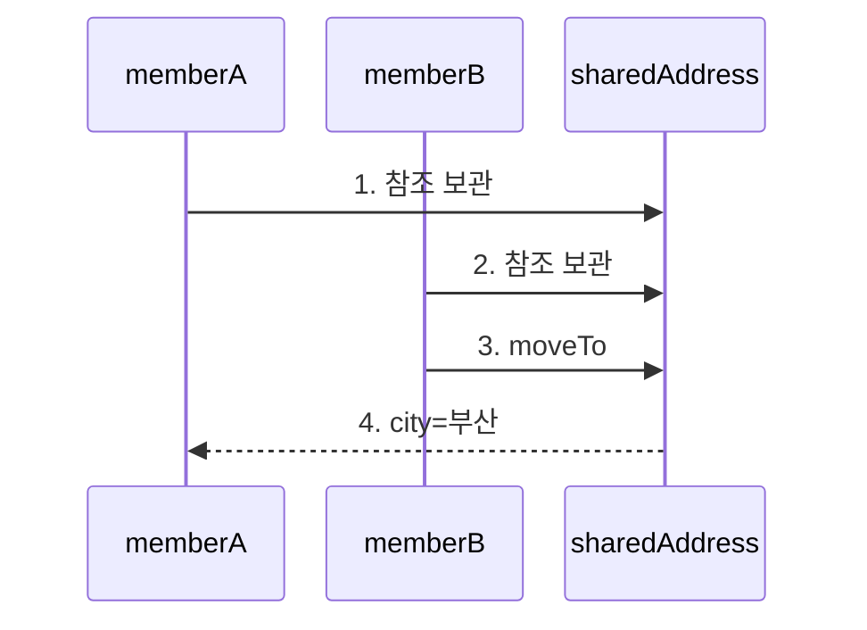
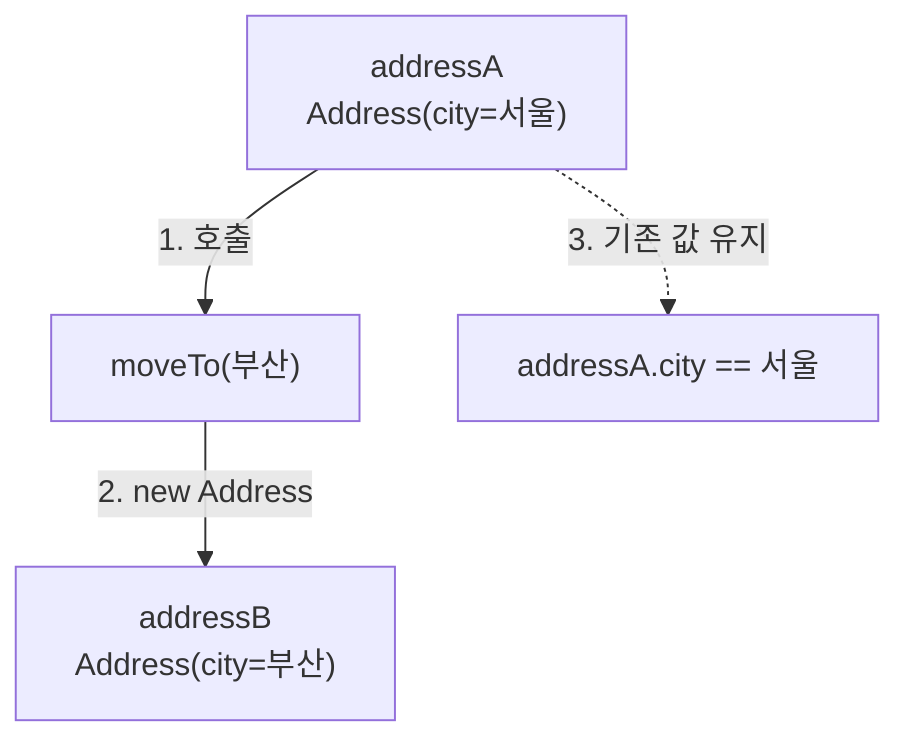

# 주소를 하나만 바꿨는데 둘 다 바뀌는 이유

회원 B의 주소만 부산으로 옮겼는데 회원 A의 주소도 부산으로 바뀝니다. 먼저 같은 객체를 공유하는 최소 예제를 실행해 이 실패를 확인합니다.

## 실행해서 문제 확인

다음 코드는 `memberA`와 `memberB`에 같은 `sharedAddress` 참조를 대입한 뒤 `memberB.moveTo("부산")`를 호출합니다.

<!-- verify-source: AddressLesson.java -->
```java
public class AddressLesson {
    private static final class MutableAddress {
        private String city;

        private MutableAddress(String city) {
            this.city = city;
        }

        private void moveTo(String city) {
            this.city = city;
        }
    }

    private static final class Address {
        private final String city;

        private Address(String city) {
            this.city = city;
        }

        private Address moveTo(String city) {
            return new Address(city);
        }
    }

    public static void main(String[] args) {
        MutableAddress sharedAddress = new MutableAddress("서울");
        MutableAddress memberA = sharedAddress;
        MutableAddress memberB = sharedAddress;
        memberB.moveTo("부산");
        System.out.println(
                "문제: memberA=" + memberA.city + ", memberB=" + memberB.city);

        Address addressA = new Address("서울");
        Address addressB = addressA.moveTo("부산");
        System.out.println(
                "개선: memberA=" + addressA.city + ", memberB=" + addressB.city);
    }
}
```

실제 실행 결과는 다음과 같습니다.

<!-- verify-output -->
```text
문제: memberA=부산, memberB=부산
개선: memberA=서울, memberB=부산
```

첫 줄에서 `memberA`까지 부산으로 바뀐 사실이 문제입니다. 두 번째 줄은 기존 주소를 유지하면서 새 주소를 만든 결과입니다.

## 왜 회원 A까지 바뀌는가

`memberA`와 `memberB`가 각각 주소 값을 가진 것이 아니라 같은 `MutableAddress` 객체의 위치를 가리키기 때문입니다. 이렇게 여러 변수가 같은 객체를 가리키는 상태를 공유 참조라고 합니다.

다음 그림은 “`memberB.moveTo("부산")`가 왜 `memberA.city`에도 보이는가?”에 답합니다.



1. `memberA`가 `sharedAddress`를 가리킵니다.
2. `memberB`도 별도 객체가 아니라 같은 `sharedAddress`를 가리킵니다.
3. `moveTo("부산")`는 공유 객체의 `city`를 변경합니다.
4. `memberA`가 읽는 대상도 같은 객체이므로 부산이 관찰됩니다.

## 기존 값을 유지하는 방법

공유 자체가 문제는 아닙니다. 공유한 객체의 내부 상태를 바꿀 수 있을 때 다른 사용자가 예상하지 못한 변경을 함께 보게 됩니다. `Address`는 `city`를 바꾸지 않고 `moveTo`에서 새 객체를 반환합니다. 생성 뒤 내부 상태가 바뀌지 않는 객체를 불변 객체라고 합니다.

다음 그림은 “새 `Address`를 반환하면 두 회원의 주소가 어떻게 분리되는가?”에 답합니다.



1. `addressA.moveTo("부산")`를 호출합니다.
2. 메서드는 기존 `addressA`를 변경하지 않고 `addressB`가 가리킬 새 객체를 반환합니다.
3. 따라서 `addressA.city`는 서울로 남고 `addressB.city`만 부산입니다.

## 적용 경계

불변 객체는 공유된 값을 안전하게 읽게 하지만 모든 객체를 자동으로 thread-safe하게 만들지는 않습니다. 내부 field가 mutable collection이면 외부에서 변경할 수 없도록 복사하거나 읽기 전용 view를 제공해야 합니다. 새 객체 생성 비용이 실제 병목인지도 측정 없이 단정하지 않습니다.

## 직접 확인할 문제

`Address`에 mutable `List<String> history`를 그대로 저장하면 어떤 경로로 내부 값이 바뀔 수 있는지 찾고, 생성 시점과 조회 시점 중 어디에서 복사가 필요한지 설명해 봅니다.

## 정리

같은 mutable 객체를 공유하면 한 변수의 변경이 다른 변수에서도 관찰됩니다. 기존 값을 바꾸지 않고 새 값을 반환하면 공유와 변경을 분리할 수 있습니다. 다음 단계에서는 collection을 field로 가진 불변 객체의 경계를 확인합니다.
